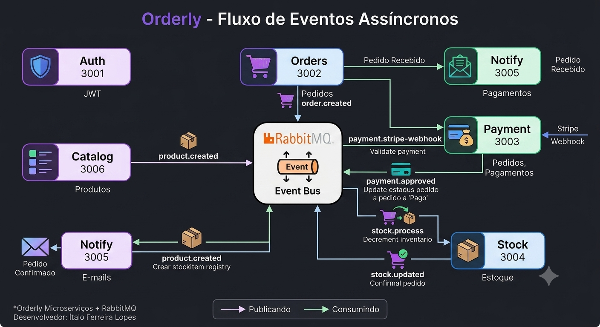

# Orderly

> Plataforma de pedidos construída com arquitetura de microserviços,
> comunicação assíncrona via RabbitMQ e deploy orquestrado com Docker.

## 📐 Arquitetura

## 🔄 Fluxo de eventos

1. **Catálogo & Estoque**: Quando um novo produto é criado no serviço `Catalog`, o evento `product.created` é disparado para que o serviço `Stock` crie o registro correspondente.
2. **Fluxo de Pedidos**: Ao finalizar um carrinho, `Orders` publica `order.created`. O microsserviço `Notify` escuta esse evento e dispara o e-mail de confirmação inicial.
3. **Pagamento & Baixa**: O webhook do Stripe bate em `Payment`, que valida e propaga `payment.approved`. O serviço `Orders` intercepta, altera o status para pago e aciona o `Stock` para decrementar as unidades vendidas

## Cartões de teste

| Cartão              | Resultado        |
|---------------------|------------------|
| 4242 4242 4242 4242 | Sempre aprovado  |
| 4000 0000 0000 0002 | Sempre recusado  |
| 4000 0025 0000 3155 | Requer 3D Secure |

Validade: qualquer data futura. CVC: qualquer 3 dígitos.

## 🛠 Stack

- Node.js + TypeScript
- RabbitMQ
- PostgreSQL
- Docker + Nginx
- React + Tailwind
- Resend

## 📡 Serviços

| Serviço | Porta | Responsabilidade |
| ------- | ----- | ---------------- |
| Auth    | 3001  | JWT              |
| Orders  | 3002  | Pedidos          |
| Payment | 3003  | Pagamentos       |
| Stock   | 3004  | Estoque          |
| Notify  | 3005  | E-mails          |
| Catalog | 3006  | Produtos         |

## Developer

Ítalo Ferreira Lopes

- 💻 - [Github](https://github.com/ItaloFL)
- 📒 - [Linkedin](https://www.linkedin.com/in/italo-ferreira-dev/)

Feito com 💜
